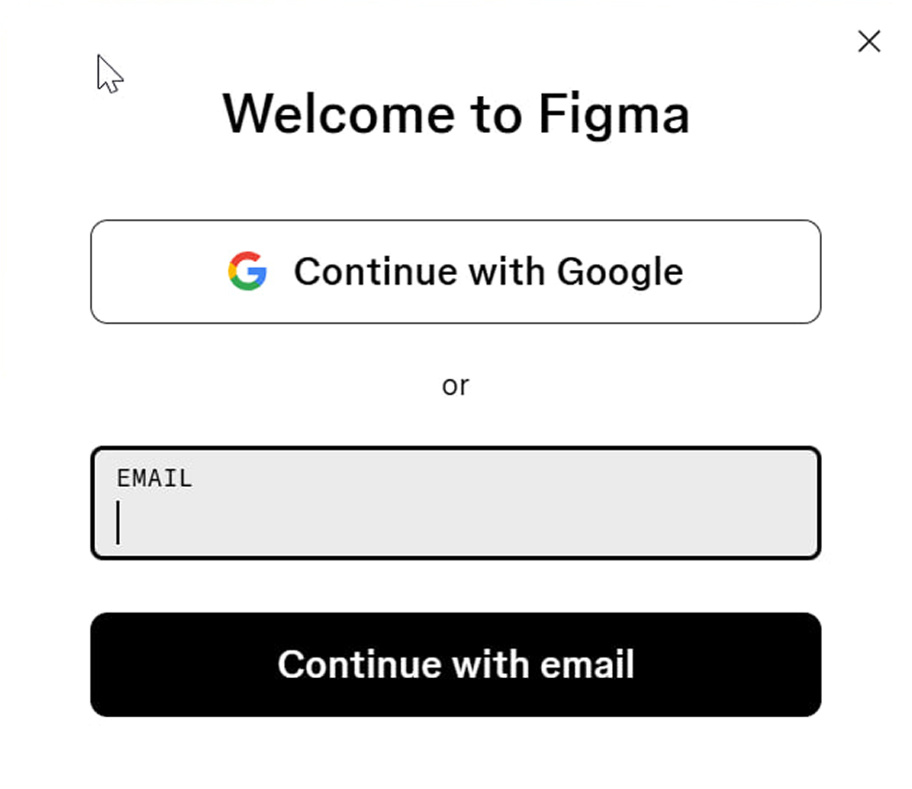
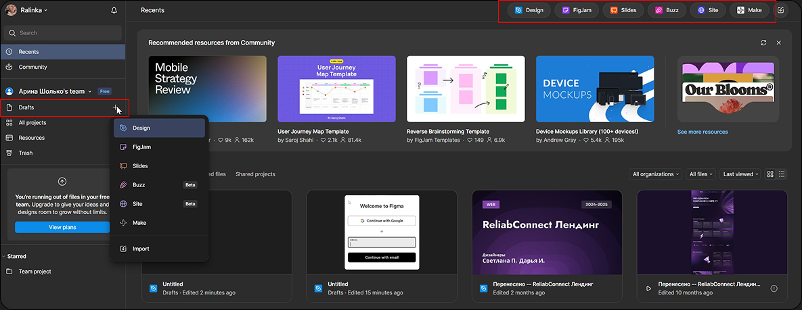

# Начало работы: регистрация и первый проект

## Регистрация в Figma

1. **Перейдите на сайт** [figma.com](https://www.figma.com)
2. **Нажмите "Get started for free"**
3. **Выберите способ регистрации** (через Google, Apple или email)

## Создание первого проекта

После успешной регистрации вы окажетесь в личном кабинетe Figma — вашей новой творческой мастерской! 🎨

### 🚀 Быстрый старт: создаем первый файл

Создать новый проект в Figma можно двумя способами:

**Вариант 1 — Через раздел Drafts**
- Найдите слева раздел **"Drafts"** (Черновики)
- Нажмите кнопку **"New file"** → **"Design"**

**Вариант 2 — Через верхнюю панель** 
- В правом верхнем углу найдите кнопку создания
- Выберите тип файла: **Design** или **FigJam**
  

✨ *По умолчанию файл получает название "Untitled" — не забудьте дать ему осмысленное имя!*

### 🤝 Присоединение к существующему проекту

Когда дизайнер приглашает вас к сотрудничеству:

1. **Перейдите по специальной ссылке-приглашению** (из email или мессенджера)
2. **Нажмите волшебную кнопку "Open in Figma"** ✨
3. **Наслаждайтесь моментальным доступом** — файл откроется прямо в браузере без установки дополнительных программ!

### 📚 Основные понятия, которые стоит знать

| Термин | Что означает | Аналогия |
|--------|-------------|----------|
| **File (Файл)** | Рабочий документ, содержащий страницы и элементы | Книга |
| **Frame (Фрейм)** | Область для дизайна (экран приложения, устройство) | Страница в книге |
| **Page (Страница)** | Вкладка внутри файла для организации работы | Глава книги |

Теперь вы готовы к созданию своего первого проекта! 🎉

[Далее: Обзор интерфейса →](./03-basic-interface.md)