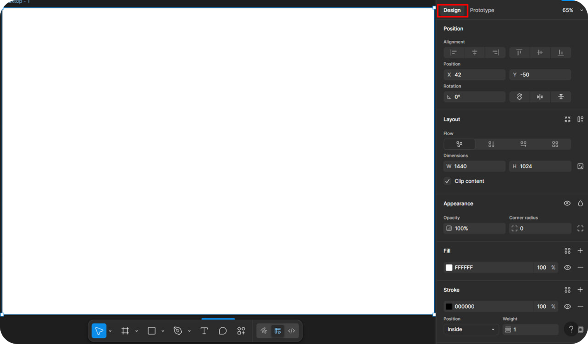

# Интерфейс редактора Figma

## Основные области интерфейса

### 1. Панель инструментов (низ)
- **Инструменты выбора** и рисования
- **Текст (T)**, **Фреймы (F)**, **Комментарии (C)**
- **Переключение между Design и Prototype** режимами

### 2. Панель слоев (слева)
- Иерархия всех элементов
- Страницы и слои
- Группы и компоненты

### 3. Панель свойств (справа) 

Это самая важная панель для технического писателя!

## Раздел Design (Дизайн)

### 🎯 Layout (Макет)
- **Position** - позиция элемента (X, Y координаты)
- **Size** - размеры (Width/Height)
- **Constraints** - как элемент ведет себя при изменении размера фрейма

### 🎨 Appearance (Внешний вид)
- **Fill** - заливка элемента
- **Stroke** - обводка
- **Effects** - тени, размытия

### 📝 Text (Текст)
- **Шрифт, размер, межстрочный интервал**
- **Выравнивание и цвет текста**
- Стили текста (если настроены в дизайн-системе)

## Раздел Prototype (Прототипирование)

### 🔗 Connections (Соединения)
- Настройка переходов между экранами
- Триггеры (клик, наведение и т.д.)
- Анимации и длительность переходов

### ⚙️ Prototype Settings (Настройки прототипа)
- Начальная точка прототипа
- Настройки устройства предпросмотра

## Практическое применение для технического писателя

### Что важно проверять в панели свойств:

1. **Текстовые стили** - единообразие заголовков и body-текста
2. **Состояния интерактивных элементов** (hover, active, disabled)
3. **Компоненты с вариантами** - разные состояния кнопок, полей ввода
4. **Auto layout настройки** - как элементы ведут себя при изменении контента

[← Назад к содержанию](./index.md)
